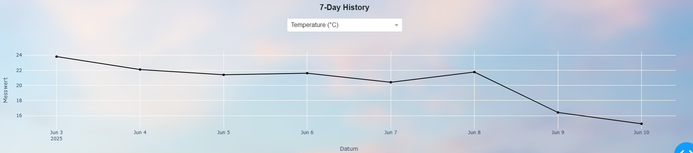

## 🌤️ Umweltmonitoring für Moste

---

## 📌 Projektüberblick

Das Ziel dieses Projekts ist die Entwicklung eines webbasierten Dashboards zur Überwachung und Vorhersage von Umweltdaten, das mit einem **senseBox** verbunden ist.

Die Anwendung stellt aktuelle Sensordaten, Prognosen für Temperatur und Niederschlag sowie den historischen Verlauf verschiedener Sensordaten der letzten 7 Tage visuell dar.

### 🧱 Systemarchitektur

Das Dashboard basiert auf drei Hauptkomponenten:

- **Datenquelle:**  
  Integration einer senseBox über die **senseBox API** zur Erfassung von Umweltdaten  
  *(z. B. Temperatur, Luftfeuchtigkeit, Luftdruck, Feinstaub)*

- **Datenhaltung:**  
  Speicherung von  **10.000 Zeitreihendatenpunkten** in einer **PostgreSQL-Datenbank mit TimescaleDB-Erweiterung**,  
  um historische Analysen und maschinelles Lernen zu ermöglichen.

- **Visualisierung:**  
  Darstellung der aktuellen Messwerte sowie historischer Entwicklungen in einem interaktiven Dashboard  
  mit **Plotly Dash**.

## 🧠 Besondere Merkmale

- Wetterdaten wie Temperatur, Luftfeuchtigkeit und Niederschlag werden **alle 3 Minuten automatisch** abgerufen und im Dashboard angezeigt. Am unteren Rand der Seite wird ein Countdown bis zum nächsten Update eingeblendet.

- Ein **Machine-Learning-Modul mit Facebook Prophet** wurde implementiert,  
  um auf Basis historischer Wetterdaten **tägliche Durchschnittswerte für den Niederschlag sowie minimale und maximale Temperaturwerte** vorherzusagen.

- Die historischen Wetterdaten (Temperatur und Niederschlag), die als Trainingsdaten für das Machine-Learning-Modell dienen, werden **alle 24 Stunden automatisch** neu abgerufen. Das Modell wird anschließend mit den aktualisierten Daten automatisch neu trainiert.

- Die Wetter-Icons im Dashboard **ändern sich** je nach vorhergesagter Niederschlagsmenge. 

< 0.2 mm >

<!-- < 2 mm -->

<!-- < 5 mm -->

<!-- < 10 mm -->

<!-- < 20 mm -->

<!-- ≥ 20 mm -->

- Ein interaktives Liniendiagramm zeigt den täglichen Verlauf verschiedener Wetterparameter der letzten 7 Tage, darunter Temperatur, Luftfeuchtigkeit, Niederschlag, Luftdruck, Windgeschwindigkeit und Feinstaubbelastung.
Über ein Dropdown-Menü kann der gewünschte Sensor ausgewählt werden.

